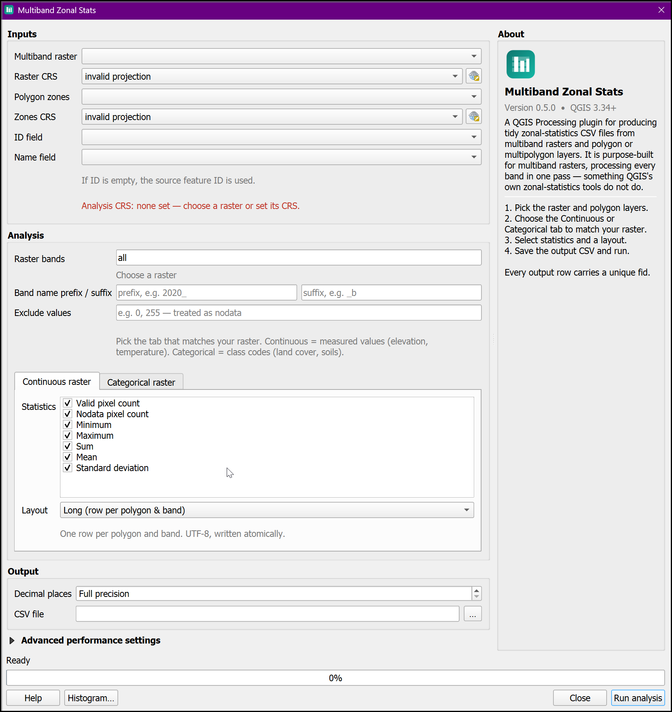

# Multiband Zonal Stats

<div align="center">
  
  <p><strong>A QGIS Processing plugin for producing tidy zonal-statistics CSV files from multiband rasters and polygon or multipolygon layers.</strong></p>
</div>

---

## Overview

**Multiband Zonal Stats** summarises a **multiband raster** over the polygons of a vector layer and writes a clean **CSV**. It is purpose-built for multiband rasters — processing every band in **one pass**, something QGIS's own zonal-statistics tools do not do.

Instead of re-reading the raster once per polygon (the slow, classic pattern), it reads the raster in **bounded tiles** and aggregates every zone and band together with NumPy — so the work scales with the raster area touched, not with *polygons × bands*.

## See it in action

<div align="center">
  
  <p><em>The dialog: continuous/categorical tabs, exclude values, decimal places, a live histogram preview, and an About panel.</em></p>
</div>

## Key features

<div class="grid cards" markdown>

-   :material-layers-triple:{ .lg .middle } **Multiband, one pass**

    ---

    Every selected band aggregated together — no looping the tool per band.

-   :material-chart-bell-curve:{ .lg .middle } **Continuous statistics**

    ---

    Count, nodata, min, max, sum, mean and population standard deviation.

-   :material-shape:{ .lg .middle } **Categorical statistics**

    ---

    Majority, minority, variety, class breakdown, and class-count columns.

-   :material-poll:{ .lg .middle } **Histogram preview**

    ---

    See any band's distribution before running — binned or per-class.

-   :material-filter-variant:{ .lg .middle } **Exclude values**

    ---

    Drop pixel values like `0` (out-of-boundary) as extra nodata.

-   :material-speedometer:{ .lg .middle } **Fast & bounded**

    ---

    Tiled reads, bounded memory, correct handling of overlapping zones.

</div>

## Quick example

A categorical land-cover raster over two districts, in the **class-counts** layout:

```text
fid,polygon_id,polygon_name,band_index,band_name,class_1,class_2,class_3,class_4
1,101,North,1,landcover,4,4,5,3
2,102,South,1,landcover,7,4,1,4
```

Every row starts with a unique `fid`, and the columns are the union of classes across all zones.

## Getting started

Ready to summarise your rasters?

[Get Started :material-arrow-right:](getting-started.md){ .md-button .md-button--primary }
[Installation Guide](installation.md){ .md-button }

## Requirements

- **QGIS version:** 3.34 or higher (runs on QGIS 3.34 – 4.x from one code path)
- **Raster source:** file-based (GDAL) — export WMS/tiled layers to GeoTIFF first
- **Dependencies:** none beyond the GDAL and NumPy that ship with QGIS

## Support

Found a bug or want a feature? Open an issue on
[GitHub](https://github.com/raymukesh/multiband-zonal-stats/issues).
